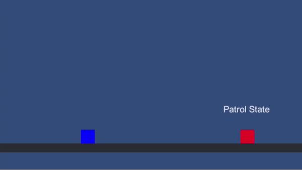

# unity-finite-state-machine

An example of finite state machines being implemented in a 2D Unity game

The following sample has a playable character and an character controlled by the finite state machine. The NPC will patrol until the playable character is within his field of view, and will stop following when the character is out his field of view.

## References

- The character controller was inspired in [SebLague 2D platform tutorial](https://github.com/SebLague/2DPlatformer-Tutorial)
- [Game Programming Patterns - Finite State Machine](https://gameprogrammingpatterns.com/state.html)

## Development setup

Just edit the project in `Unity 2019.2.0f1 +`

## Development Flow

How add a new character with different behaviour

- Create a new class that extends the **FSM base class**, this will be the FSM class for the new character
- Create new State classes if the basic ones don't have the expected behaviour
- Create new Transition classes if the basic ones don't have the expected behaviour
- In the FSM class for the new character, override the SetupStates
- Instantiate the required states and transtions, use serialized fields to ease the config setup in unity engine
- Use the created states and setup its transtions by calling SetTransitions
- Assign the starting state
- Create an awareness object if your states and transtions use one
- Call SetAwareness to set it in the base class

## Contributing

1. Fork it
2. Create your feature branch
3. Push to the branch
4. Create a new pull request

## License

- **[MIT license](http://opensource.org/licenses/mit-license.php)**
